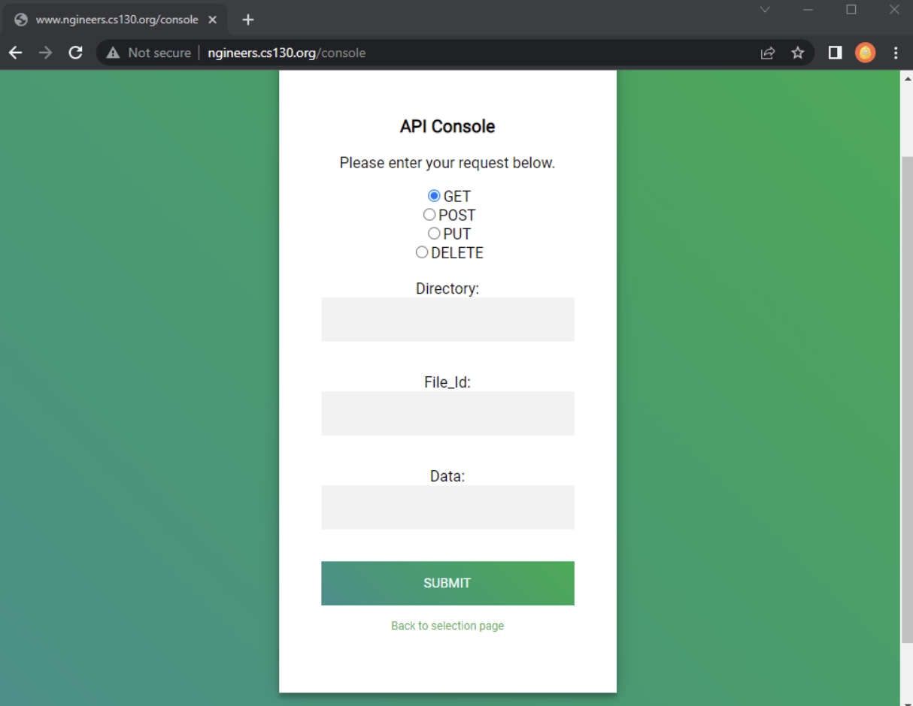

# Configurable Boost Web Server



## Repository Structure

```
├── Boost-Web-Server/ # Top-level root of repository
│   ├── media/ # Contains the project report and supporting images
│   ├── config/ # Stores all development and testing configuration files
│   ├── docker/ # Stores all docker files for generating images
│   ├── include/ # Contains all header files
│   │   ├── http/ # Contains all headers relevant to sending/receiving http objects
│   │   ├── request_handler/ # Contains all headers for request handlers
│   │   └── request_handler_factory/ # Contains all headers for request handler factories
│   ├── src/ # Contains all source code files
│   ├── http/ # Contains all code relevant to sending/receiving http objects
│   │   ├── request_handler/ # Contains all code for request handlers
│   │   └── request_handler_factory/ # Contains all code for request handler factories
│   └── tests/ # Contains all test files
│       ├── integration_tests/ # Contains integration test script and expected outputs
│       ├── static_files/ # Contains static test files
│       └── test_config/ # Contains test configurations
```


## Building the Code
1. At the top level root directory, create a build directory by using command `mkdir build`.
2. Go into the build directory by using command `cd build` then use command `cmake ..` to configure and create the relevant build files.
3. Use command `make` to build and link the program.


## Testing the Code
1. Navigate to the build directory.
2. Use the command `make test` to run the unit and integration tests. 
3. To see a detailed test outcome, use command `ctest -V`.


## Running the Code
1. Navigate to the build directory.
2. Use the command `./bin/webserver <path_to_config>` to launch the web server (the config path is usually `../config/<your_config>` if your configuration file is placed there).


## Building and Running the Docker Image
1. Navigate to the root directory.
2. Use `docker build -f docker/base.Dockerfile -t base .` to build the base image.
3. Use `docker build -f docker/Dockerfile -t server .` to build the web server image.
4. Use `docker build -f docker/coverage.Dockerfile -t coverage .` to build the coverage image.
5. Use `docker run --rm -p <test_port>:80 --name server_run server:latest` to run the docker image locally.

## Important Files
**root**
- CMakeLists.txt: New handlers/factories should be referenced here in order to build and link the webserver binary correctly.

**config**
- test_config: Configuration file for local testing.
- deploy_config: Configuration for deployed docker image.

**include/http**
- path.h: New endpoint types should be added to the endpoint_type enum. (https://code.cs130.org/plugins/gitiles/ngineers/+/refs/heads/main/include/http/path.h#11)

**src**
- config_parser.cc: New endpoint types should be added in the configuration parser.
([https://code.cs130.org/plugins/gitiles/ngineers/+/refs/heads/main/src/config_parser.cc#105])
- server.cc: New factories should be added to the create_handler_factory function.
([https://code.cs130.org/plugins/gitiles/ngineers/+/refs/heads/main/src/server.cc#77])

See later sections for more on adding request handlers and factories.

## Config File Format
As mentioned above in the config folder there is a test configuration and a deploy configuration. They both start by declaring the port that the server will listen to with the keyword “port”. For the test config it listens to port 8080 and for deployment it listens to the reserved port 80.

The rest of the statements for both are “location” statements, which conform to the “location-major typed” format. In these statements, the location keyword is followed by the serving path, followed by the name of the handler, and possible arguments inside `{...}`. 
Right now, the static handler statements have a root argument that declares the directory where the handler will serve files from, and the echo handler statement doesn’t have any arguments because there’s no need at the moment.

When adding another handler, make sure to follow the format explained above and used here:
[https://code.cs130.org/plugins/gitiles/ngineers/+/refs/heads/main/config/test_config] 


## RequestHandler Interface
The request handler interface consists of a serve function and a destructor. The serve function is a pure virtual function that is inherited and overridden by the other handlers in the program. It takes in two parameters, an http::request object and the address of an http::response object. The response is modified in the function and when finished returns the http::status of the response object.

### Example of a RequestHandler Child Class
**echo_handler.h**
```
#ifndef REQUEST_HANDLER_INTERFACE_H
#define REQUEST_HANDLER_INTERFACE_H

#include <vector>

#include <boost/beast/core.hpp>
#include <boost/beast/http.hpp>
#include "util.h"

namespace beast = boost::beast;
namespace http = beast::http;

/** 
 * Parent class for request interface objects. Request handlers 
 * are designed to return a HTTP reply given different requests 
 * that are received.
 */
class request_handler_interface
{
  public:
    virtual http::status serve(const http::request<http::dynamic_body> req, http::response<http::dynamic_body>& res) = 0;
    virtual ~request_handler_interface() {}
};

#endif
```

**echo_handler.cc**
```
#include <cstddef>
#include <string>
#include <vector>

#include "request_handler/echo_handler.h"

/**
 * Generate an echo handler with location.
 */
echo_handler::echo_handler(std::string location, std::string request_url) 
  : location_(location), request_url_(request_url) {

}

/**
 * Construct an HTTP structured reply for the received echo request.
 */
http::status echo_handler::serve(const http::request<http::dynamic_body> req, http::response<http::dynamic_body>& res)
{
  res.result(http::status::ok);
  beast::ostream(res.body()) << req;
  res.content_length((res.body().size()));
  res.set(http::field::content_type, "text/plain");
  return res.result();
}
```
The different handler constructors will take in different values depending on what is needed. For example, the echo location takes in two string parameters: the location where files are to be served and the request url. What it takes is up to the user's discretion, but it should include everything necessary for the serve function to properly work.

### Adding Another RequestHandler
To add another request handler, create a corresponding header and source file in the request_handler folders. In the header file, include the parent class `request_handler_interface.h`. Next, make sure to `make request_handler_interface` public when declaring the class. Additionally, make the constructor and the inherited serve function public as well, while making any additional objects private.

In the source file, include the header file of this new request handler and any other useful header file or libraries. Then implement the constructor and the serve function. Remember to have it return an http::status object whenever a process exits the function.

Note: In the request handler interface there are two namespaces declared: `beast` and `http`. If you need a `boost::beast` or `boost::beast::http` object in any of the request handlers you can simply call it with beast and http respectively (as seen previously with `http::request`, `http::response`, etc). 


## RequestHandlerFactory Interface
The request handler interface consists of a create function and a destructor. The create function is a pure virtual function and it is inherited and overridden by other request handler factories in the program. The create function takes two string objects as its parameters, one is location and the other one is request url. It returns a RequestHandler pointer.

### Example of a RequestHandlerFactory Child Class
**echo_handler_factory.h**
```
#include "request_handler_factory.h"
#include "http/path.h"

/**
 *  Echo handler factory class
 *  
 *  Inherits from request_handler_factory
 *  
 *  The echo handler factory constructs a echo handler factory
 *  by giving the location and path
 *
 *  The function create will return a request_handler_interface point.
 *  In this class, the return pointer point to a echo handler.
 *  
 */
class echo_handler_factory : public request_handler_factory
{
  public:
    echo_handler_factory(std::string location, path root_file_path);

    request_handler_interface* create(std::string location, std::string request_url);

  private:
    std::string location_;
    path root_file_path_;
};
```

**echo_handler_factory.cc**
```
#include "request_handler_factory/echo_handler_factory.h"
#include "request_handler/echo_handler.h"

echo_handler_factory::echo_handler_factory(std::string location, path root_file_path) :
      location_(location), root_file_path_(root_file_path)
{

}

request_handler_interface* echo_handler_factory::create(std::string location, std::string request_url)
{
  return new echo_handler(location);
}
```

The RequestHandlerFactories’ constructor takes a `string` object *location* and a `path` object *root_file_path* to construct a *RequestHandlerFactory* object. For example the echo_handler_factory constructor will construct a `echo_handler_factory` object by giving it an *location* and *path*.
The create function is inherited from the *RequestHandlerFactory* interface and it returns a corresponding handler pointer. In `echo_handler_factory`, the create function takes two `string` objects *location* and *request_url* and returns an `echo_handler` pointer.


## Adding Another RequestHandlerFactory
To add another RequestHandlerFactory, a working corresponding RequestHandler is needed. In the header file, first include the RequestHandlerFactory parent class `request_handler_factory.h` and the path class `http/path`.h. Then create a new RequestHandlerFactory class that inherits the request_handler_factory. Inside this new class, write a constructor for this handler factory and the constructor needs to take a string object and a path object as its parameters (see the `echo_handler_factory` class). A override `create` function is also needed. Make the constructor and `create` function public, and create a private string object and a private path object which will hold the value of the constructor's parameter.

In the source file, include the header file of this new request handler factory and any other useful header file or libraries. Then implement the constructor and the create function. Keep in mind that the `create` function will return a *RequestHandler* pointer.
